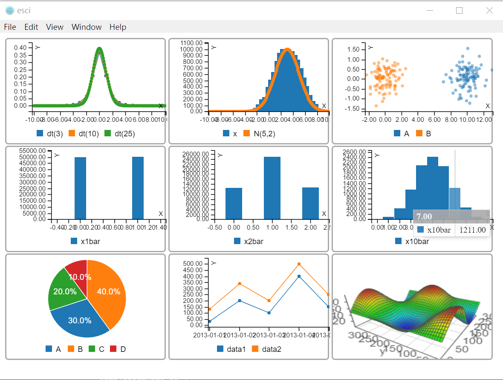

# Scijs -- A Scientific Chart GUI for based on Electron/node.js

## Install

1. Make sure you have install Electron.js in global mode.
2. npm install this project in global mode.

```
$ npm install -g electron
$ npm install -g scijs
```

## Run

```
$ scijs <file>
```


## Example : ChartDemo

File: [chartDemo.js](demo/chartDemo.js)

```
var j6 = require('j6')

function hist (g, name, x, k) {
  var mk = x.mfillv(k, x.length / k)
  var xbar = mk.colSum()
  c6.ihist(g, name, xbar, 'bar')
}

function main () {
  c6.chart2D('#chart1', function (g) {
    var dt = j6.dt
    c6.curve(g, 'dt(3)', (x) => dt(x, 3), -5, 5, 1)
    c6.curve(g, 'dt(10)', (x) => dt(x, 10))
    c6.curve(g, 'dt(25)', (x) => dt(x, 25))
  })
  c6.chart2D('#chart2', function (g) {
    var x = j6.rnorm(10000, 3, 2)
    c6.hist(g, 'x', x, 'bar', -10, 10, 0.5)
    c6.curve(g, 'N(5,2)', (x) => j6.dnorm(x, 3, 2) * 10000 / 2)
  })
  c6.chart2D('#chart3', function (g) {
    var Ax = j6.rnorm(100, 10, 1)
    var Ay = j6.rnorm(100, 0, 0.5)
    var Bx = j6.rnorm(100, 0, 1)
    var By = j6.rnorm(100, 0, 0.5)
    c6.plot(g, 'A', Ax, Ay)
    c6.plot(g, 'B', Bx, By)
  })
  var x = j6.samples([0, 1], 100000, {replace: true})
  c6.chart2D('#chart4', (g) => hist(g, 'x1bar', x, 1))
  c6.chart2D('#chart5', (g) => hist(g, 'x2bar', x, 2))
  c6.chart2D('#chart6', (g) => hist(g, 'x10bar', x, 10))
  c6.chart2D('#chart7', (g) => c6.pie(g, {A: 30, B: 40, C: 20, D: 10}))
  c6.chart2D('#chart8', (g) => c6.timeSeries(g, [
    ['x', '2013-01-01','2013-01-02','2013-01-03','2013-01-04','2013-01-05'],
    ['data1',       30,         200,         100,         400,         150],
    ['data2',      130,         340,         200,         500,         250]
  ]))
  c6.chart2D('#chart9', (g) => hist(g, 'x1bar', x, 1))
  c6.chart3D('#chart9', 'surface', function (x, y) {
    return (Math.sin(x / 50) * Math.cos(y / 50) * 50 + 50)
  })
  c6.view()
}

main()

```

Run

```
$ scijs chartDemo.js
```



## Notice

1. Scijs run file in [electron.js renderer process](https://github.com/electron/electron/blob/master/docs/tutorial/quick-start.md#renderer-process) mode .
2. If your code is not an electron renderer module, just use the `node <file>` to run in node.js mode.
